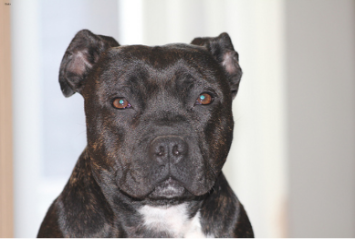
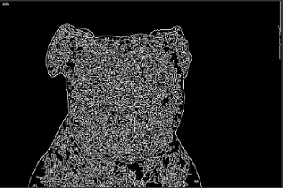
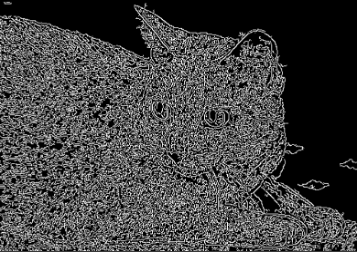

## Описание
Шаги работы:
1. Выбраны операторы, которые наилучшим образом определяют контуры объектов и подобраны параметры для них
2. Подобрана последовательность морфологических операций, которая позволяет достичь наилучшего значения метрик
3. Вычислена скорость работы и результирующая метрика алгоритма

Наилучшее значение метрики составило: **89,34%**
Скорость работы: **0,74 s/Mpx**

## Подробный разбор шагов
### Шаг 1. Выбор операторов и подбор параметров

Было проведено сравнение операторов: Собеля, Лапласа и Кэнни.
В результате для дальнейшей работы был выбран оператор Кэнни, потому что с его помощью получается наилучшим образом выделить контур
требуемого объекта для большинства изображений. Также полученный результат позволяет успешно использовать морфологические операции
для дальнейшей работы и улучшения точности алгоритма, так как полученный контур в большинстве случаев замкнут, что
упрощает использование морфологических операций.

Для каждого оператора был проведен подбор параметров для сравнения метрик.
В результате подбора и сравнения результатов для оператора Кэнни были определены параметры **23, 74**
При использовании только оператора Кэнни с этими параметрами метрика составила **27,27%**
Код:
```python
img_op = cv2.Canny(img, 23, 74)
```
### Шаг 2. Определение морфологических операций

После использования оператора Кенни на основе исходных изображений отмечались контуры.
Пример результатов работы оператора Кенни представлен ниже:


Пример 1.

 | 

Пример 2.

 | 

Для дальнейшего улучшения метрики использовались морфологические операции
Итоговая последовательность состоит из:
1. Closing с параметрами ядра: Эллипс 40, 26
  Используется для удаления ненужных зон внутри выделяемого объекта
2. Closing с параметрами ядра: Эллипс 12, 13
  Также используется для удаления ненужных зон с большим шагом
3. Dilate с параметром итераций=1, параметры ядра: Эллипс 15, 9
  Используется для увеличения границ контура и покрытия дополнительных возможных участков выделяемого объекта

Код:
```python
import cv2   
kernel = cv2.getStructuringElement(cv2.MORPH_ELLIPSE, (40, 26))
close = cv2.morphologyEx(img_op, cv2.MORPH_CLOSE, kernel)

kernel = cv2.getStructuringElement(cv2.MORPH_ELLIPSE, (12, 13))
close = cv2.morphologyEx(close, cv2.MORPH_CLOSE, kernel)

kernel = cv2.getStructuringElement(cv2.MORPH_ELLIPSE, (15, 9))
dilated = cv2.dilate(close,kernel,iterations = 1)
```

Такая последовательность была определена после экспериментов с различным набором операций и последовательностей их выполнения, а также значениями их параметров,
основываясь на изменении значения метрик при изменении операторов.

### Шаг 3. Вычисление скорости работы

1. Скорость алгоритма в среде Google Collab - использовался серверный ускоритель Python 3 на базе Google Compute Engine(): оперативная память 12.7 Гб, диск 107.7 Гб. 
составила **2.7 s/Mpx**
2. Скорость алгоритма в среде Мас  - использовался  Python 3.11.5 на базе Аппле М1 про процессор: оперативная память 16 Гб, диск 500 Гб. составила **0.74 s/Mpx**

### Colab:

Использовать данный <a href="https://colab.research.google.com/drive/1RYayQDRQRPseGXzsGuotu-l7zJeNR_MY?usp=sharing#scrollTo=Q6oVXw9NQlpv" target="_blank">ноутбук</a>
