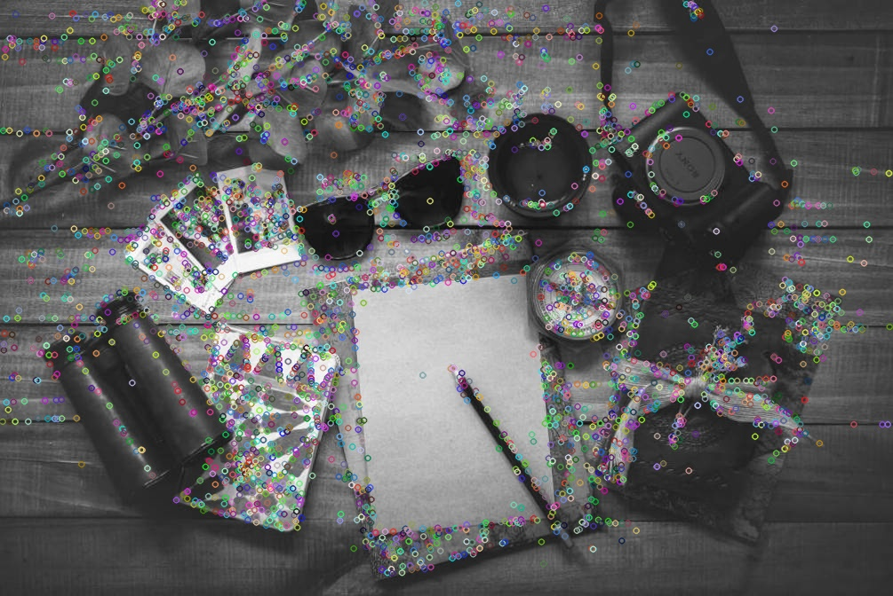
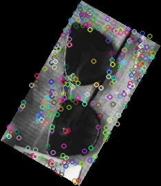
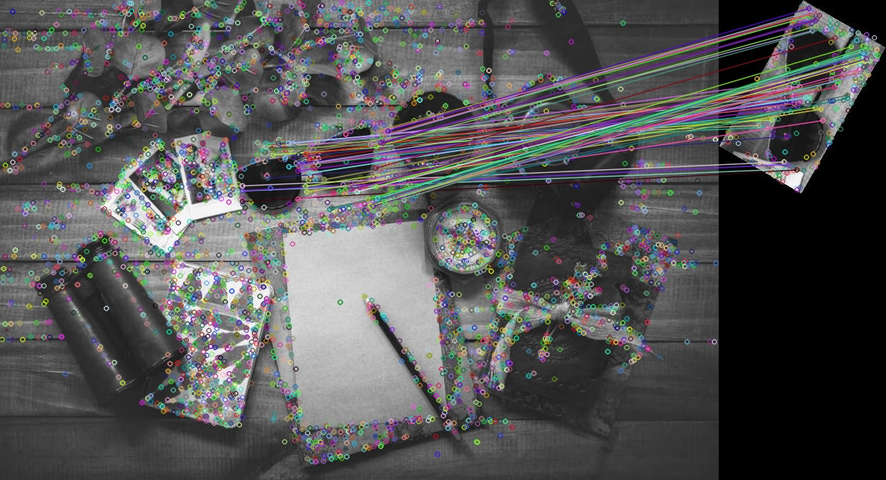

# Команда 6

## Описание
Шаги работы:
1. Выделены ключевые точки на изображении и на шаблоне;
2. Выполнено попарное сравнение и определены те, которые имеют соответствия;
3. Определены самые крайние точки по всем четырем направлениям, затем по ним - координаты левого верхнего и правого нижнего углов рамки;
4. Выполнен расчет метрики.

<b>Наилучшее значение метрик составило: </b>

## Подробный разбор шагов

1. Считываем исходное изображение и шаблон. Применяем детектор ключевых точек SIFT для поиска ключевых точек на исходном изображении и на шаблоне.
2. Для наглядности результата отметим ключевые точки на обоих изобрадениях и сохраним изображения в папку.
   
Пример 1 - Выделение ключевых точек на изображении и шаблоне<br/>

 

3. Используя ``FlannBasedMatcher`` из библиотеки openCV и его метод ``knnMatch``, и сравнивая расстояния, найдем соответсвия между ключевыми точками исходного изображения и изображения-шаблона, чтобы определить общие точки. Тем самым мы сможем отобрать только те ключевые точки исходного изображения, которые соответсвуют искомому объекту.
4. В процессе обхода ключевых точек будем запоминать координаты x для самой левой и самой правой точек, координаты y для самой верхней и самой нижней точек. При этом округляя в меньшую или большую сторону, для того, чтобы выделить координаты "с запасом" и весь объект попал в рамку, в случае, когда координаты ключевых точек являются нецелыми числами.
5. Для наглядности используем ``drawMatches``, который склеивает исходное изображение и шаблон и соединяет линиями идентичные ключевые точки на обоих изображениях.
   
Пример 2 - Выявление соответсвий между ключевыми точками изображения и шаблона<br/>

 

6. В качестве координат рамки берем ``(x1, y1) и (x2, y2)``, где ``x1`` - самая левая координата, ``y1`` - самая верняя, ``x2`` - самая правая и ``y2`` - самая нижняя соответсвенно.
## Код

```python

def matchTemplate(path_img, path_pattern):
    input_image = cv2.imread(path_img, 0)
    pattern_template = cv2.imread(path_pattern, 0)

    input_name = path_img[path_img.rfind('/') + 1:path_img.rfind('.jpg')]
    pattern_name = path_pattern[path_pattern.rfind('/') + 1:path_pattern.rfind('.jpg')]                                                                     

    path = './key_points'
    is_exist  = os.path.exists('./key_points')
    
    if not os.path.exists(path):
        os.mkdir(path)
        
    if not os.path.exists(path + '/input'):
        os.mkdir(path + '/input')

    if not os.path.exists(path + '/pattern'):
        os.mkdir(path + '/pattern')

    if not os.path.exists('./result'):
        os.mkdir('./result')

    
    sift = cv2.SIFT_create()
    
    input_kp, input_desc = sift.detectAndCompute(input_image, None)
    input_image_kp = cv2.drawKeypoints(input_image, input_kp, input_image)
    kp_input_name = 'key_points/input/kp_' + input_name + '.jpg'
    cv2.imwrite(kp_input_name, input_image_kp)
    
    pattern_kp, pattern_desc = sift.detectAndCompute(pattern_template,None)
    pattern_image_kp = cv2.drawKeypoints(pattern_template, pattern_kp, pattern_template)
    kp_pattern_name = 'key_points/pattern/kp_' + pattern_name + '.jpg'
    cv2.imwrite(kp_pattern_name, pattern_image_kp)

    index_params = dict(algorithm=0, trees=5)
    search_params = dict()
    flann = cv2.FlannBasedMatcher(index_params, search_params)
    matches = flann.knnMatch(input_desc, pattern_desc, k=2)

    points = []


    height, width =  input_image.shape
    
    r = 0
    b = 0
    l = width
    t = height
    
    ratio = 0.7
    for i, j in matches:
        if i.distance < ratio*j.distance:
            points.append(i)
            
            img1_idx = i.queryIdx
            
            (x, y) = input_kp[img1_idx].pt
            if x > r:
                r = math.floor(x) + 1
            if x < l:
                l = math.floor(x)
            if y < t:
                t = math.floor(y)
            if y > b:
                b = math.floor(y) + 1
        
    result = cv2.drawMatches(input_image, input_kp, pattern_template, pattern_kp, points, None)
    cv2.imwrite('result/' + 'result_' + input_name + '.jpg', result)
    

    highlight_start = (l, t)
    highlight_end = (r, b)
    
    return highlight_start, highlight_end```

## Результаты
В процессе выполнения работы были сравнены различные алгоритмы детекции ключевых точек, а также их гиперпараметры. Представленные параметры были отмечены, как дающие наилучшие значения метрики.
