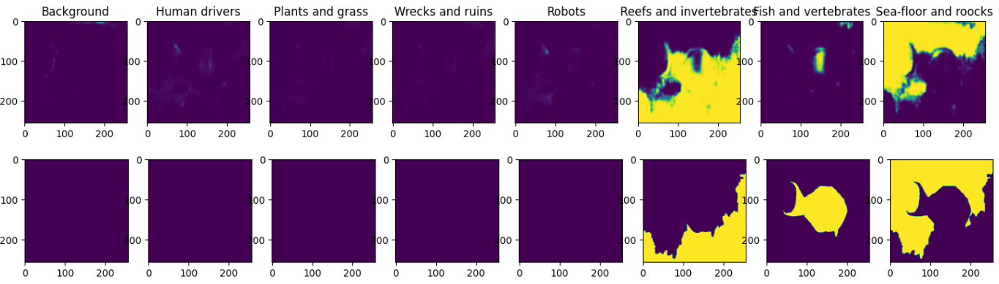
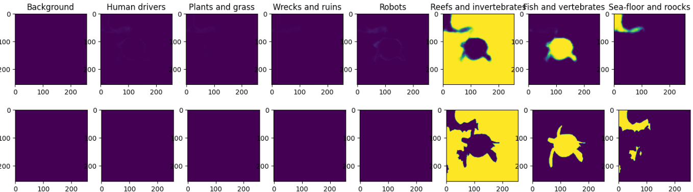

# Решение
## Описание задачи
* Задача - сегментация изображений с определением класса выделенной области.
Полное описание представлено в файле [task.md](task.md)

## Метрики
Метрики оценки качества сегментации:  
IoU:  
  
Per-class IoU:  
IoU по каждому из 8 классов  
Per-pixel accuracy:  
  

## Результаты
### Описание архитектуры решения
В качестве способа решения поставленной задачи было решено построить модель на основе архитектуры U-Net. Данная архитектура позволяет
добиться хороших результатов при решении задач сегментации. Сеть U-Net предаствляет из себя последовательность сверточных слоев (convolution)
и пуллинга, а также upconvolution слоев. Результаты convolution и upconvolution слоев соотвестнно конкатенируются между собой и передаются
на следующий upconvolution слой. На этапе свертки каждый сверточный слой содержит две последовательные свертки и функцию активации ReLU.

* Оптимизатор - Adam, 150 эпох, loss = Binary crossentropy + 0.25 * DICE.
* Эта потеря объединяет потерю Dice со стандартной бинарной кросс-энтропийной потерей (BCE), которая обычно используется по умолчанию для моделей сегментации. Объединение двух методов позволяет внести некоторое разнообразие в потери, извлекая выгоду из стабильности BCE.

* Также для исключения переобучения и повышения производительности сети использовались слои Dropout и BatchNorm.
* Тренировочная и тестовая выборки составляют 80% и 20% от исходного набора.

## Сравнение результатов работы
Пример 1:

Пример 2:

Пример 3:


## Значения метрик
|   IoU   |                  Per-class IoU                   | Per-pixel accuracy | Time per image, sec|
|---------|--------------------------------------------------|--------------------|--------------------|
| 0.537   | [0.64, 0.62, 0.75, 0.75, 0.89, 0.26, 0.17, 0.21] | 0.614              | 0.317              |

## Структура сети
```python
def unet_model(image_size, output_classes):
    input_layer = tf.keras.layers.Input(shape=image_size + (3,))
    conv_1 = tf.keras.layers.Conv2D(64, 4, activation=tf.keras.layers.LeakyReLU(),
                                    strides=2, padding='same', kernel_initializer='glorot_normal',
                                    use_bias=False)(input_layer)
    
    conv_1_1 = tf.keras.layers.Conv2D(128, 4, activation=tf.keras.layers.LeakyReLU(), strides=2,
                                      padding='same', kernel_initializer='glorot_normal',
                                      use_bias=False)(conv_1)
    batch_norm_1 = tf.keras.layers.BatchNormalization()(conv_1_1)

    conv_2 = tf.keras.layers.Conv2D(256, 4, activation=tf.keras.layers.LeakyReLU(), strides=2,
                                      padding='same', kernel_initializer='glorot_normal',
                                      use_bias=False)(batch_norm_1)
    batch_norm_2 = tf.keras.layers.BatchNormalization()(conv_2)

    conv_3 = tf.keras.layers.Conv2D(512, 4, activation=tf.keras.layers.LeakyReLU(), strides=2,
                                      padding='same', kernel_initializer='glorot_normal',
                                      use_bias=False)(batch_norm_2)
    batch_norm_3 = tf.keras.layers.BatchNormalization()(conv_3)

    conv_4 = tf.keras.layers.Conv2D(512, 4, activation=tf.keras.layers.LeakyReLU(), strides=2,
                                      padding='same', kernel_initializer='glorot_normal',
                                      use_bias=False)(batch_norm_3)
    batch_norm_4 = tf.keras.layers.BatchNormalization()(conv_4)

    conv_5 = tf.keras.layers.Conv2D(512, 4, activation=tf.keras.layers.LeakyReLU(), strides=2,
                                      padding='same', kernel_initializer='glorot_normal',
                                      use_bias=False)(batch_norm_4)
    batch_norm_5 = tf.keras.layers.BatchNormalization()(conv_5)

    conv_6 = tf.keras.layers.Conv2D(512, 4, activation=tf.keras.layers.LeakyReLU(), strides=2,
                                      padding='same', kernel_initializer='glorot_normal',
                                      use_bias=False)(batch_norm_5)


    up_1 = tf.keras.layers.Concatenate()([tf.keras.layers.Conv2DTranspose(512, 4, activation='relu', strides=2,
                                                                          padding='same',
                                                                          kernel_initializer='glorot_normal',
                                                                          use_bias=False)(conv_6), conv_5])
    batch_up_1 = tf.keras.layers.BatchNormalization()(up_1)

    batch_up_1 = tf.keras.layers.Dropout(0.25)(batch_up_1)

    up_2 = tf.keras.layers.Concatenate()([tf.keras.layers.Conv2DTranspose(512, 4, activation='relu', strides=2,
                                                                          padding='same',
                                                                          kernel_initializer='glorot_normal',
                                                                          use_bias=False)(batch_up_1), conv_4])
    batch_up_2 = tf.keras.layers.BatchNormalization()(up_2)
    batch_up_2 = tf.keras.layers.Dropout(0.25)(batch_up_2)


    up_3 = tf.keras.layers.Concatenate()([tf.keras.layers.Conv2DTranspose(512, 4, activation='relu', strides=2,
                                                                          padding='same',
                                                                          kernel_initializer='glorot_normal',
                                                                          use_bias=False)(batch_up_2), conv_3])
    batch_up_3 = tf.keras.layers.BatchNormalization()(up_3)
    batch_up_3 = tf.keras.layers.Dropout(0.25)(batch_up_3)


    up_4 = tf.keras.layers.Concatenate()([tf.keras.layers.Conv2DTranspose(256, 4, activation='relu', strides=2,
                                                                          padding='same',
                                                                          kernel_initializer='glorot_normal',
                                                                          use_bias=False)(batch_up_3), conv_2])
    batch_up_4 = tf.keras.layers.BatchNormalization()(up_4)


    up_5 = tf.keras.layers.Concatenate()([tf.keras.layers.Conv2DTranspose(128, 4, activation='relu', strides=2,
                                                                          padding='same',
                                                                          kernel_initializer='glorot_normal',
                                                                          use_bias=False)(batch_up_4), conv_1_1])
    batch_up_5 = tf.keras.layers.BatchNormalization()(up_5)


    up_6 = tf.keras.layers.Concatenate()([tf.keras.layers.Conv2DTranspose(64, 4, activation='relu', strides=2,
                                                                          padding='same',
                                                                          kernel_initializer='glorot_normal',
                                                                          use_bias=False)(batch_up_5), conv_1])
    batch_up_6 = tf.keras.layers.BatchNormalization()(up_6)


    output_layer = tf.keras.layers.Conv2DTranspose(output_classes, 4, activation='sigmoid', strides=2,
                                                   padding='same',
                                                   kernel_initializer='glorot_normal')(batch_up_6)

    model = tf.keras.Model(inputs=input_layer, outputs=output_layer)
    return model
```
