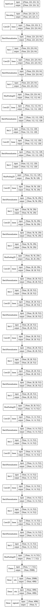

# Команда 6

<b>Наилучшее значение метрики составило: 0,9131 </b>

## Описание шагов работы

1. Загружаем папку с изображениями, проверяем соответсвие расширений разрешенному набору для TensorFlow, иначе заменяем старое изображение на новое, с допустимым расширением;
2. Делим датасет на обучающую и тестовую выборку;
3. Выполняем предобработку входных изображений;
4. Задаем параметры модели - количество слоев, параметры свертки, пуллинга и т.д.;
5. Осуществляем обучение модели;
6. Измеряем среднее значение метрики f1-score по всем 5 классам и время инференса модели при обработке одного изображения в секундах.

 

## Результаты

