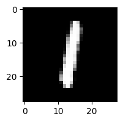

# Решение
## Описание задачи
* Задача - генерация изображений на основе датасета MNIST. <br/>
Полное описание представлено в файле [task.md](task.md)


## Результаты
### Описание архитектуры решения
В качестве способа решения поставленной задачи было решено построить модель на основе архитектуры VAE+GAN. Данная сеть является трехкомпонентной и состоит из следующих основных частей, которые, по сути, обучаются отдельно друг от друга - энкодер, декодер и дискриминатор. Задача энкодера - научиться переводить изображения в скрытое пространство признаков, декодера - восстанавливать исходное изображение по вектору скрытых признаков. Дискриминатор используется в данной модели только на этапе обучение, и его задача - отличать сгенерированное изображение от реального. Применение дискриминатора для обучения VAE позволяет получить более качественную генерацию изображений, т.к. иначе тяжело подобрать хорошую метрику для оценки качества работы VAE. 

Нами было решено использовать не просто VAE, а CVAE - conditional variation autoencoder, на вход которого, помимо самого изображения также подаются метки классов. Добавление меток классов позволяет более качественно моделировать многообразие данных.

При обучении использовались три отдельных лосса для каждой из частей моделей, а также три оптимизатора - RMSProp, с разными значениями learning rate.

```
opt_enc = tf.train.RMSPropOptimizer(0.001)
opt_dec = tf.train.RMSPropOptimizer(0.0001)
opt_dis = tf.train.RMSPropOptimizer(0.001)
```

Обучение проводилос на 50 эпохах.
Также, поскольку для модели VAE+GAN зачастую характерно неравномерное обучение, было выбрано разное количество шагов для VAE и дискриминатора. Так, на 1 шаг обучения дискриминатора приходилось 4 шага обучения для VAE, поскольку в противном случае дискриминатор быстро начинал переобучаться.


## Сравнение результатов восстановления данных на тестовых данных в процессе обучения
Пример 1:

Пример 2:

Пример 3:

Пример 4:

Пример 5:

Пример 6:

Пример 7:

Пример 8:


## Структура сети
### Энкодер
```python
x = Conv2D(32, kernel_size=(3, 3), strides=(2, 2), padding='same')(img)
x = LeakyReLU()(x)
x = MaxPool2D((2, 2), padding='same')(x)

x = Conv2D(64, kernel_size=(3, 3), padding='same')(x)
x = LeakyReLU()(x)

x = Flatten()(x)
x = concatenate([x, lbl])

h = Dense(64)(x)
h = LeakyReLU()(h)

z_mean    = Dense(latent_dim)(h)
z_log_var = Dense(latent_dim)(h)

def sampling(args):
    z_mean, z_log_var = args
    epsilon = K.random_normal(shape=(batch_size, latent_dim), mean=0., stddev=1.0)
    return z_mean + K.exp(K.clip(z_log_var/2, -2, 2)) * epsilon
l = Lambda(sampling, output_shape=(latent_dim,))([z_mean, z_log_var])
encoder = Model([img, lbl], [z_mean, z_log_var, l], name='Encoder')
```

### Декодер
```python
x = concatenate([z, lbl])
x = Dense(7*7*128)(x)
x = LeakyReLU()(x)
x = Reshape((7, 7, 128))(x)
x = UpSampling2D(size=(2, 2))(x)

x = Conv2D(64, kernel_size=(5, 5), padding='same')(x)
x = LeakyReLU()(x)

x = Conv2D(32, kernel_size=(3, 3), padding='same')(x)
x = UpSampling2D(size=(2, 2))(x)
x = LeakyReLU()(x)

decoded = Conv2D(1, kernel_size=(5, 5), activation='sigmoid', padding='same')(x)
decoder = Model([z, lbl], decoded, name='Decoder')
```

### Дискриминатор
```python
x = Conv2D(128, kernel_size=(7, 7), strides=(2, 2), padding='same')(img)
x = MaxPool2D((2, 2), padding='same')(x)
x = LeakyReLU()(x)

repeat = RepeatVector(int(x.shape[1]) * int(x.shape[2]))(lbl)
repeat = Reshape((x.shape[1], x.shape[2], lbl.shape[1]))(repeat)
x = concatenate([x, repeat])

x = Conv2D(64, kernel_size=(3, 3), padding='same')(x)
x = MaxPool2D((2, 2), padding='same')(x)
x = LeakyReLU()(x)

l = Conv2D(16, kernel_size=(3, 3), padding='same')(x)
x = LeakyReLU()(x)

h = Flatten()(x)
d = Dense(1, activation='sigmoid')(h)
discrim = Model([img, lbl], [d, l], name='Discriminator')
```
## Результаты генерации картинок нужного лейбла из шума


  
  
  

